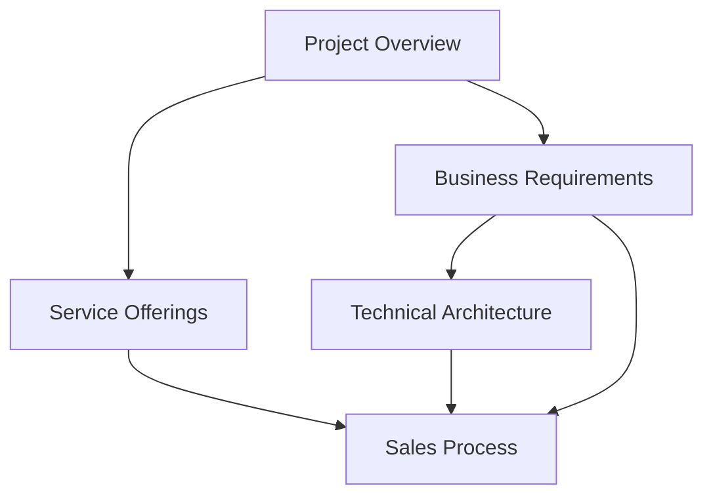

# 📚 ManyChatBot Project Documentation

**Comprehensive documentation for the ManyChatBot lead capture website and integration system**

## 📋 Table of Contents

- [Introduction](#-introduction)
- [Document Catalog](#-document-catalog)
- [How to Use This Documentation](#-how-to-use-this-documentation)
- [Document Relationships](#-document-relationships)
- [Contribution Guidelines](#-contribution-guidelines)
- [Version History](#-version-history)

## 🔍 Introduction

This directory contains all the official documentation related to the ManyChatBot project. These documents serve as the authoritative reference for both the business strategy and technical implementation, and should be consulted throughout the development process to ensure alignment with project goals.

The documentation is designed to provide a comprehensive understanding of the project's objectives, requirements, architecture, and processes. Each document focuses on a specific aspect of the project to provide clarity and depth.

## 📂 Document Catalog

<table>
<tr>
<th width="25%">Document</th>
<th width="75%">Description</th>
</tr>
<tr>
<td><a href="project_overview.md"><strong>Project Overview</strong></a></td>
<td>
<ul>
<li>High-level introduction to the project</li>
<li>Company mission and core value proposition</li>
<li>Project scope and objectives</li>
<li>Timeline and success metrics</li>
</ul>
</td>
</tr>
<tr>
<td><a href="business_requirements.md"><strong>Business Requirements</strong></a></td>
<td>
<ul>
<li>Detailed business needs and goals</li>
<li>Target audience analysis</li>
<li>Functional and non-functional requirements</li>
<li>User journey specifications</li>
<li>Success criteria and constraints</li>
</ul>
</td>
</tr>
<tr>
<td><a href="technical_architecture.md"><strong>Technical Architecture</strong></a></td>
<td>
<ul>
<li>System architecture diagrams and explanations</li>
<li>Component definitions and relationships</li>
<li>Integration specifications</li>
<li>Data flow documentation</li>
<li>Security considerations</li>
</ul>
</td>
</tr>
<tr>
<td><a href="service_offerings.md"><strong>Service Offerings</strong></a></td>
<td>
<ul>
<li>Detailed description of service packages</li>
<li>Pricing structure and justification</li>
<li>Feature comparison across tiers</li>
<li>Implementation process by package</li>
<li>Value proposition and competitive analysis</li>
</ul>
</td>
</tr>
<tr>
<td><a href="sales_process.md"><strong>Sales Process</strong></a></td>
<td>
<ul>
<li>End-to-end sales workflow</li>
<li>Client acquisition channels</li>
<li>Consultation and proposal procedures</li>
<li>Onboarding methodology</li>
<li>Payment structure and options</li>
</ul>
</td>
</tr>
</table>

## 🔄 How to Use This Documentation

These documents are designed to be read in sequence for new team members, but can also be referenced individually based on specific needs:

1. **For Executive Overview**: Start with the [Project Overview](project_overview.md)
2. **For Product Team**: Focus on [Business Requirements](business_requirements.md) and [Service Offerings](service_offerings.md)
3. **For Development Team**: Prioritize [Technical Architecture](technical_architecture.md) and refer to [Business Requirements](business_requirements.md)
4. **For Sales Team**: Review [Service Offerings](service_offerings.md) and [Sales Process](sales_process.md)

## 🔗 Document Relationships

The diagram above illustrates how these documents relate to and inform each other. The project overview establishes the foundation, with business requirements and service offerings building upon it. The technical architecture is derived from business requirements, while the sales process is informed by multiple documents.

## ✏️ Contribution Guidelines

When updating these documents, please adhere to the following guidelines:

1. **Maintain Consistency**: Ensure terminology remains consistent across all documents
2. **Version Control**: Update the version history when making significant changes
3. **Review Process**: All updates should be reviewed by relevant stakeholders
4. **Format Standardization**: Follow the established markdown formatting conventions
5. **Diagram Updates**: When updating diagrams, also update the HTML versions in the `/diagrams` directory

## 📅 Version History

| Document | Current Version | Last Updated | Change Summary |
|----------|----------------|--------------|----------------|
| Project Overview | 1.0 | 2025-03-26 | Initial document creation |
| Business Requirements | 1.0 | 2025-03-26 | Initial document creation |
| Technical Architecture | 1.0 | 2025-03-26 | Initial document creation |
| Service Offerings | 1.0 | 2025-03-26 | Initial document creation |
| Sales Process | 1.0 | 2025-03-26 | Initial document creation |

---

**ManyChatBot Documentation** | Last updated: March 26, 2025

