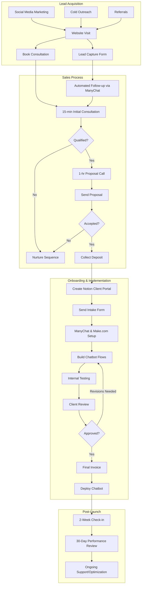

# Sales Process

## Overview

This document outlines the end-to-end sales process for ManyChatBot services, from lead acquisition through client onboarding. The process is designed to efficiently qualify leads, demonstrate value, and convert prospects into clients.

## Operational Flow Diagram

## Client Acquisition Channels

### Cold Outreach
- Identify businesses with high-volume social interactions
- Use targeted messaging focusing on reducing manual engagement workload
- Highlight potential ROI and time savings
- Direct prospects to book a 15-minute consultation

### Referrals
- Encourage satisfied clients to refer others
- Offer incentives (future discounts, free upgrades)
- Provide existing clients with shareable content
- Simplify the referral process

### Inbound via Content Marketing
- Create educational content demonstrating chatbot benefits
- Focus on time savings, increased sales, and automated engagement
- Use social proof through case studies and testimonials
- Drive traffic to the lead capture website

## Consultation Process

### Initial 15-Minute Consultation Structure

#### Pre-Call Preparation
- Research prospect's Instagram account
- Note current engagement patterns and response times
- Prepare 1-2 specific examples of improvement opportunities

#### First 3 Minutes: Pattern Interrupt & Qualification
- Skip traditional pleasantries and dive straight in
- Quickly establish if they meet criteria (30+ DMs/comments weekly)
- Set clear expectations for the call

#### Minutes 3-8: Pain Amplification
- Ask targeted questions about current challenges
- Calculate current losses from delayed responses
- Help prospect recognize the cost of the status quo

#### Minutes 8-12: Solution & Transformation
- Show concrete examples of chatbot success
- Present before/after scenarios
- Calculate potential ROI based on their numbers

#### Final 3 Minutes: Call to Action
- Present clear options
- Remove risk with guarantee
- Set next steps (proposal call booking)

### 1-Hour Proposal Call Structure
- Deep dive into business needs and current processes
- Detailed demonstration of chatbot capabilities
- Customized solution presentation
- Address questions and objections
- Present formal proposal with pricing options
- Secure commitment and collect deposit

## Client Onboarding Process

1. **Send Welcome Email**
   - Introduction to the team
   - Overview of next steps
   - Access to Notion client portal

2. **Information Collection**
   - Send intake form for brand information
   - Gather existing sales scripts and FAQs
   - Collect login credentials for platforms

3. **Account Setup**
   - Create/connect ManyChat account
   - Set up Make.com workflows
   - Establish monitoring and analytics

4. **Development & Testing**
   - Build chatbot conversation flows
   - Integrate with required platforms
   - Internal testing of all scenarios

5. **Client Review & Approval**
   - Demonstration of chatbot functionality
   - Gather feedback and make revisions
   - Final approval from client

6. **Launch & Training**
   - Deploy chatbot to live environment
   - Provide usage training to client team
   - Schedule follow-up check-ins

## Pricing & Payment Structure

### Payment Schedule Options
- **Option 1:** 50% deposit, 50% upon approval
- **Option 2:** 100% payment upon project completion
- **Option 3:** 30% deposit, 70% upon approval

### Payment Methods
- Credit card
- Bank transfer
- PayPal

## Success Metrics

- Initial consultation to proposal conversion: Target 60%+
- Proposal to signed client conversion: Target 40%+
- Client onboarding time: 2-5 business days
- Client satisfaction with sales process: 4.5/5 or higher
