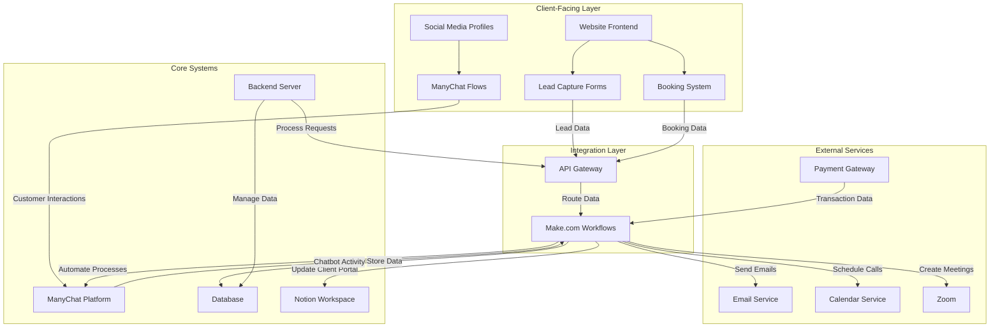

# Technical Architecture

## Overview

This document outlines the technical architecture for the ManyChatBot website and service delivery system. The architecture is designed to support lead capture, client onboarding, and chatbot implementation processes.

## System Components

### Core Platforms

- **ManyChat**: Primary chatbot platform for building automated conversations
  - Handles conversation flows and logic
  - Integrates with Facebook Messenger and Instagram
  - Provides analytics on chatbot performance

- **Make.com** (formerly Integromat): Workflow automation platform
  - Connects ManyChat with other systems
  - Handles data transfer between platforms
  - Automates repetitive processes

- **Notion**: Collaborative workspace
  - Client portals for project management
  - Internal documentation and processes
  - Support and feature request tracking

### Web Application Components

- **Frontend**: 
  - HTML5, CSS3, JavaScript
  - Responsive design framework
  - Modern UI with intuitive navigation

- **Backend**:
  - API-driven architecture
  - Data processing and validation
  - Security and authentication

- **Database**:
  - Lead information storage
  - Client data management
  - Analytics and performance data

- **Booking System**:
  - Calendar integration
  - Automated confirmation and reminders
  - Timezone handling

## Technical Architecture Diagram

## APIs & Integrations

- **ManyChat API**: 
  - Creates and manages chatbot flows programmatically
  - Handles subscriber data and tags
  - Provides analytics endpoints

- **Facebook Graph API**: 
  - Integrates with Instagram and Facebook pages
  - Manages permissions and connections

- **Calendar API** (Calendly or Google Calendar): 
  - Manages appointment booking
  - Handles availability and time slots

- **Payment Gateway API**:
  - Processes deposits and payments
  - Handles transaction security

- **Email Service Provider API**:
  - Sends automated emails
  - Tracks open and click rates

- **Zoom API**: 
  - Creates and schedules meetings
  - Manages participant access

## Data Flow

1. **Lead Capture**: 
   - Visitor enters information on website
   - Data is validated and stored in database
   - Lead information is sent to ManyChat for follow-up

2. **Consultation Booking**:
   - Lead selects available time slot
   - Booking is confirmed and added to calendar
   - Automated confirmation sent to lead
   - Notification sent to team

3. **Client Onboarding**:
   - Client submits onboarding form
   - Data is processed via Make.com
   - Notion client portal is created
   - ManyChat automation is set up

4. **Chatbot Implementation**:
   - Chatbot flows are created in ManyChat
   - Make.com scenarios connect external systems
   - Testing is conducted across platforms
   - Analytics are set up for performance tracking

## Security Considerations

- All data transmission uses HTTPS encryption
- PII (Personally Identifiable Information) is stored securely
- Payment processing follows PCI compliance standards
- Authentication uses industry-standard protocols
- Regular security audits and updates
